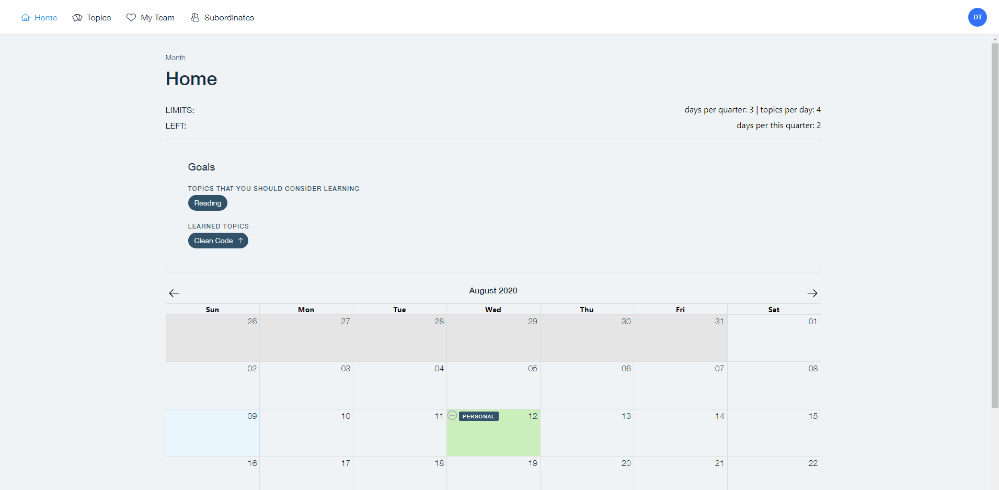

# epicenter-tp-learning-calendar

### A platform for managing off-work learning days for both employees and employers

Features:

- Invite team members by email
- See your learning days, as well as learning days of your team members
- Create, edit topics and subtopics
- Assign goals (topics to learn) to your team members
- See tree of topics (personal, your team, etc.)

